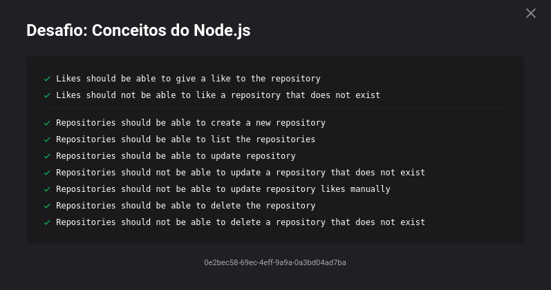
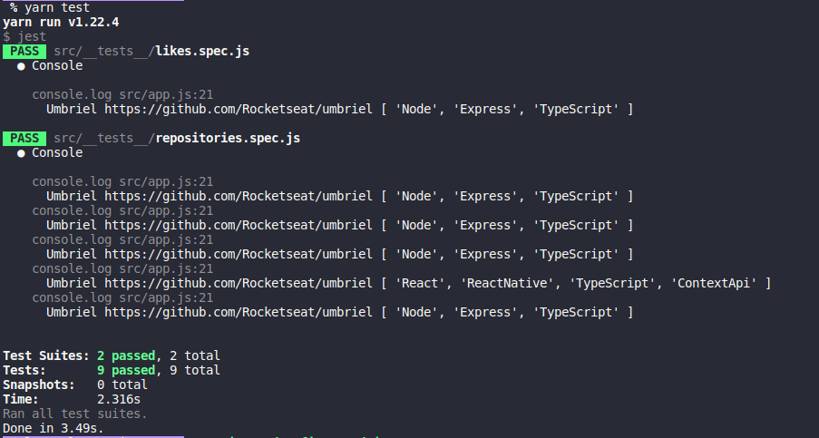

<h1 align="center">
  Desafio 02: Conceitos NodeJS
</h1>

<blockquote align="center">“Não espere para plantar, apenas tenha paciência para colher”!</blockquote>

## Sobre o desafio 
Primeiro desafio técnico do GoStack 11.0!  
Fizemos uma API simples com NodeJS para comprovar que entendemos os conceitos do NodeJS que foi explicado nas primeiras aulas do bootcamp  
Foi usado o Jest (uma estrutura de testes criada pelo Facebook) para realizar os testes e ver se passamos no desafio, os testes eram os seguintes 🛠 
  
</img>
  
Para mais detalhes sobre o desafio e que era precisa ser feito para ser passado em cada teste, você pode ver neste <a href="https://github.com/rocketseat-education/bootcamp-gostack-desafios/tree/master/desafio-conceitos-nodejs">link</a>.

## Resultado dos testes
 
</img>

## Author:

* **Paulo Vaz** - [LinkedIn](https://www.linkedin.com/in/paulo-vaz-05296a46/)

## Acknowledgments

Este projeto foi construído durante as aulas do GoStack  da [RocketSeat](https://rocketseat.com.br/).